# Stima di V* e Q* con LLM in MiniGrid-DoorKey 8×8 — Sintesi per l'incontro

> Cartella `src/thesis`. Obiettivo: verificare se un LLM riesce a stimare zero-shot la funzione valore ottima `V*(s)` e `Q*(s,a)` in MiniGrid-DoorKey a partire da una storia di osservazioni ASCII, e se tali stime sono utilizzabili per accelerare l'apprendimento per rinforzo.

---

## 1. Cosa è stato provato

| Script | Cosa fa | Output |
|---|---|---|
| `scripts/state_export2.py` | Calcola `V*` ottima con Value Iteration (`γ=0.99`) sull'MDP deterministico DoorKey 8×8 e genera il dataset di storie. Ogni seed produce 5 tipi di traiettoria: `initial`, `worst`, `intermediate`, `transition`, `off_track`, con `n_maps` = numero di mappe ASCII mostrate all'LLM. | `files/<seed>/*.txt` + `files/metadata.csv` (30 seed, ~320 righe) |
| `scripts/q_export.py` | Come sopra, ma emette per ogni stato anche le 5 `Q*(s,a)` con `entry_type`. | Stessa struttura, 6× righe (1 stato + 5 azioni) |
| `scripts/state_export.py` | Versione precedente con euristica `γ^distanza` via BFS — deprecata. | — |
| `llm/gconnection.py`, `llm/gconnection-q.py` | Interroga l'LLM con `docs/Prompt.txt` (V) o `docs/Prompt_q.txt` (Q). Prompt = documentazione + definizione V/Q + legenda + 1–5 storie ASCII. | `result/8x8 final/V/h{1,3,5}/*.csv` e `Q/h3/v{1,2}_*.csv` |
| `result/evaluate.py` | Valuta `v_value` vs `v_llm` e genera 9 grafici di confronto globale + 8 per file. | `result/grafici_V/grafici/confronto_*.png` + `log_valutazione.txt` |
| `result/evaluate_q.py` | Valuta `q_value` vs `q_llm` + selezione azione (Top-1/2/3, value loss, confusion matrix). | `result/grafici_Q/grafici/confronto_*.png` |
| `agent/doorkey_state.py` + `agent/doorkey_qtable.py`, `doorkey_qtable_anchor.py`, `doorkey_qtable_warmstart.py`, `doorkey_ddqn.py`, `doorkey_ddqn_anchor.py` | Testano l'uso delle stime LLM in RL tabulare e DDQN tramite reward shaping potenziale, anchor sul Bellman e warm-start di Q. | `qtable_compare.png`, `ddqn_compare.png`, ecc. |

**Ambiente:** `MiniGrid-DoorKey-8x8-v0` (wrapper in `env/` per la vista ASCII e gli eventi chiave/porta/goal). Ground truth sempre da Value Iteration.

---

## 2. Legenda — cosa misurano gli script di valutazione

Ogni riga dei CSV in `result/8x8 final/` è uno stato (V) o una coppia stato-azione (Q) con `v_value`/`q_value` (ground truth) e `v_llm`/`q_llm` (stima LLM). I grafici e le tabelle non riportano i CSV grezzi, ma il confronto tra i due:

* **MAE / RMSE** — errore medio assoluto e quadratico (più basso = meglio).
* **Pearson r / Spearman ρ** — correlazione lineare e di rango (−1..1).
* **CCC (Lin)** — concordanza: come Pearson ma penalizza bias e slope ≠ 1 (metrica di accordo principale).
* **IC 95%** — intervallo di confidenza al 95% via bootstrap sui seed (intervalli non sovrapposti = differenza significativa).
* **bias** — media di `v_llm − v_value` (negativo = sottostima).
* **slope / intercept** — retta `v_llm ~ v_value` (ideale: slope 1, intercept 0).
* **failure rate** — quota di righe con `v_llm/q_llm == 0` (LLM non ha risposto).
* **entro 0.05 / 0.10** — percentuale di stime con errore sotto soglia.
* **Accordo categoriale Low/Mid/High** — soglie ai quantili 33°/66° per ogni `type`: verifica se LLM e ground truth cadono nella stessa fascia.
* **Top-1/2/3 accuracy (solo Q)** — quante volte l'azione con `q_llm` più alta coincide con quella ottima (`argmax q_value`). Baseline casuale 20% (5 azioni). **Value loss** = perdita di reward per aver scelto l'azione LLM invece dell'ottima.

---

## 3. Struttura dei CSV

### 3.1 `files/metadata.csv` — ground truth prima dell'interrogazione LLM

Generato da `scripts/state_export2.py` / `scripts/q_export.py`, 30 seed × ~11 storie.

```
id,seed,type,x,y,agent_dir,path,file,step_start,step_end,event,n_maps,v_value,v_llm
000001,102,initial,1,1,3,102/initial_step_0000_find_key.txt,initial_step_0000_find_key.txt,0,0,find_key,1,0.8097,0
000003,102,transition,2,4,1,102/transition_step_0005_0007_find_key.txt,transition_step_0005_0007_find_key.txt,5,7,find_key,3,0.8687,0
000009,102,off_track,1,3,2,102/off_track/off_track_step_0000_find_key.txt,off_track_step_0000_find_key.txt,0,0,find_key,3,0.8179,0
```

* `x,y,agent_dir` — posizione e direzione dell'agente nello stato valutato (ultima mappa della storia).
* `path,file` — percorso del file di testo con le `n_maps` mappe ASCII.
* `step_start/step_end` — indici di inizio/fine della finestra di storia nel rollout.
* `type` — `initial` (step 0), `worst` (valore minimo lungo la traiettoria), `intermediate` (3 step prima di una transizione), `transition` (finestra che termina sul cambio di stage), `off_track` (cella fuori dall'ottimo).
* `event` — `find_key` / `open_door` / `reach_goal`.
* `n_maps` — quante mappe contiene il file (1 per `initial`/`worst`, 3–5 per gli altri, corrisponde a `h`).
* `v_value` — `V*` ottima da Value Iteration; `v_llm` inizialmente 0, poi riempito dall'LLM.

### 3.2 `result/8x8 final/V/h{1,3,5}/*.csv` — risultati V

```
id,seed,type,path,file,step_start,step_end,event,n_maps,v_value,v_llm
000030,860,intermediate,860/intermediate_step_0022_0024_reach_goal.txt,intermediate_step_0022_0024_reach_goal.txt,22,24,reach_goal,3,0.99,0.9801
000044,106,initial,106/initial_step_0000_find_key.txt,initial_step_0000_find_key.txt,0,0,find_key,1,0.8345,0.8016
```

Stesse colonne di `metadata.csv` (senza `x,y,agent_dir`), `v_llm` ora valorizzato. `v_llm==0` = failure. La cartella `h1`/`h3`/`h5` indica quante mappe sono state mostrate nel prompt.

### 3.3 `result/8x8 final/Q/h3/v1_*.csv` — risultati Q diretti (v1)

```
id,seed,type,path,file,step_start,step_end,event,n_maps,action,q_value,q_llm
000139,860,transition,860/transition_step_0019_0021_open_door.txt,transition_step_0019_0021_open_door.txt,19,21,open_door,3,left,0.94148,0.01
000139,860,transition,860/transition_step_0019_0021_open_door.txt,transition_step_0019_0021_open_door.txt,19,21,open_door,3,right,0.94148,0.01
000139,860,transition,860/transition_step_0019_0021_open_door.txt,transition_step_0019_0021_open_door.txt,19,21,open_door,3,forward,0.95099,0.02
```

* `action` — una delle 5 azioni valutate (`left`, `right`, `forward`, `pickup`, `toggle`).
* `q_value` — `Q*(s,a) = r + γ·V*(s')` da Value Iteration.
* `q_llm` — stima LLM per quella stessa `(s,a)`. Stesso `id` logico (`000139`) si ripete per 5 righe, una per azione.

### 3.4 `result/8x8 final/Q/h3/v2_*.csv` — risultati V(s') (v2)

```
id,seed,type,path,file,step_start,step_end,event,n_maps,action,q_value,q_llm
001497,413,intermediate,413/intermediate_step_0019_0021_reach_goal.txt,intermediate_step_0019_0021_reach_goal.txt,19,21,reach_goal,3,right,0.970299,0.97
000725,330,transition,330/transition_step_0020_0022_reach_goal.txt,transition_step_0020_0022_reach_goal.txt,20,22,reach_goal,3,pickup,0.99,0.99
```

Stessa struttura di v1, ma `q_llm` è la stima di `V(s')` (valore dello stato successore) anziché di `Q(s,a)`. Confronto sempre `q_value` vs `q_llm` per uniformità di valutazione, ma semanticamente è `V*(s')` vs `V_llm(s')`.

---

## 4. Prompt e JSON prodotti dai modelli

### 4.1 Storia ASCII inviata all'LLM

Ogni `files/<seed>/*.txt` contiene 1–5 mappe + legenda. Esempio `transition_step_0052_0054_reach_goal.txt` (2 mappe, agente con chiave `L(U)` vicino al goal `G`):

```
================================================
+----+----+----+----+----+----+
|    |    | ▇  |    |    |    |
|    |    |D(O)|    |    |    |
|    |    | ▇  |    |    |    |
|    |    | ▇  |    |    |    |
|    |    | ▇  |    |    |L(U)|
|    |    | ▇  |    |    | G  |
+----+----+----+----+----+----+
================================================
+----+----+----+----+----+----+
|    |    | ▇  |    |    |    |
|    |    |D(O)|    |    |    |
|    |    | ▇  |    |    |    |
|    |    | ▇  |    |    |    |
|    |    | ▇  |    |    |L(U)|
|    |    | ▇  |    |    | G  |
...

Legend: A(U/D/R/L)=agent, L(U)=agent con chiave, ▇=muro, D(L/O)=porta, G=goal
Stage: FIND_KEY / OPEN_DOOR / REACH_GOAL
```

### 4.2 Prompt V — `docs/Prompt.txt` (estratto)

> Sei un agente RL sull'ambiente DoorKey. Leggi `<documentation>` e `<legend>`, valuta la storia `<history_xxxx>` (xxxx = codice identificativo), ogni storia è indipendente, stima il V-value dell'ultimo stato.
>
> Regole: considera `γ=0.99`, valore normalizzato, un singolo float per `<history>`, se richiesto scrivi `analisys` motivando con definizione e documentazione.
>
> Output obbligatorio (solo array JSON, senza altro testo):
> ```json
> [{
>   "code": "000116",
>   "analisys": "...",
>   "v-function-value": 0.87
> }, ...]
> ```
> Segue `X<legend>` con le mappe e la legenda.

### 4.3 Prompt Q v1 — `docs/Prompt_q.txt` (estratto)

> Stesso preambolo, ma stima i Q-value dell'ultimo stato per **ogni azione**.
>
> ```json
> [{
>   "code": "000116",
>   "analisys": "...",
>   "q-function-values": {
>     "left": 0.12, "right": 0.15, "forward": 0.89,
>     "pickup": 0.02, "drop": 0.01, "toggle": 0.01
>   }
> }, ...]
> ```

### 4.4 Prompt Q v2 — `docs/en/Prompt-q2-en.txt` (estratto)

> Inside each `<history_xxxx>` you will find the state description followed by an `<action>` tag. Estimate the **V-value for the state reached from (s,a)**.
>
> ```json
> [{
>   "code": "000116",
>   "action": "forward",
>   "analisys": "...",
>   "v_function_value": 0.92
> }, ...]
> ```

### 4.5 JSON prodotti — risposte reali dei modelli

> **Nota storica:** i CSV in `result/8x8 final/` salvano solo `id` + `v_llm`/`q_llm` (il campo `analisys` viene scartato dopo il parsing e la risposta grezza veniva solo stampata). Le risposte che hanno generato quei CSV non sono quindi più recuperabili. I JSON sotto sono **nuove chiamate reali** con **stesso prompt, stesso `temperature` e stesso stato** (`000030` per V/Q v1, `000044` per Q v2), catturate ora per mostrare il formato autentico. I valori sono quindi freschi ma rappresentativi e coerenti con i CSV (es. CSV gemma V 000030 = 0.9801, fresca = 0.99). **Latenza osservata: Gemma ~2–3 minuti, Groq/gpt-oss ~2–10 secondi.**

I file completi sono salvati in `result/real_json_examples/` per consultazione.

**V — gemma-4-26b, stato `000030` (intermediate REACH_GOAL, h3, `v_value` 0.99) — risposta reale Gemma (125s):**

```json
[{"code": "000030", "analisys": "L'agente ha già raccolto la chiave (L) e la porta è aperta (D(O)). L'obiettivo (G) si trova nella cella immediatamente sotto l'agente (posizione 5,5 rispetto alla 4,5). Poiché l'agente è rivolto a destra (R), l'azione ottimale è 'left' per ruotare verso il basso, seguita da 'forward' per raggiungere il traguardo. Seguendo la definizione di v-function, il ritorno atteso è $G_t = \\gamma^1 \\cdot R_{t+2}$ (poiché il reward viene erogato solo al raggiungimento del goal al secondo passo), che con $\\gamma=0.99$ e reward massimo $1.0$ è pari a $0.99$.", "v-function-value": 0.99}]
```
*File: `result/real_json_examples/gemma_V_000030.json` — CSV storico per lo stesso stato: `v_llm` 0.9801.*

**V — gpt-oss-120b (Groq), stesso stato `000030` — risposta reale Groq (2.3s):**

```json
[{"code": "000030", "analisys": "Lo stato finale mostra l'agente carico (L) a destra della porta già aperta, di fronte al goal G. L'agente può girare a destra (azione \"right\") e poi avanzare (azione \"forward\") per raggiungere il goal in due passi. Il reward per il raggiungimento del goal è quasi 1 (1 - 0.9·(step_count/max_steps)) e, con gamma=0.99, il valore atteso è ≈0.99·1 ≈ 0.99. Normalizzato nel range [0,1] il v‑function value è quindi circa 0.98.", "v-function-value": 0.98}]
```
*File: `result/real_json_examples/groq_V_000030.json`.*

**Q v1 — gemma-4-26b, stato `000030` — risposta reale Gemma (157s, 5 valori insieme):**

```json
[{"code": "000030", "analisys": "L'agente si trova nello stato L(R) alla posizione (4, 5), avendo già raccolto la chiave. Il goal G è situato in (5, 5), direttamente sotto l'agente. L'azione 'right' è quella che massimizza il ritorno atteso $G_t$ secondo la definizione di $q$-function, poiché permette di orientarsi verso il basso (Down) per raggiungere il goal in soli due step ('right' seguito da 'forward'). L'azione 'left' ha un valore inferiore poiché richiede più rotazioni per l'orientamento, aumentando il numero di step $k$ e riducendo il valore scontato $\\gamma^k R$. Le azioni 'forward', 'pickup', 'drop' e 'toggle' sono inefficienti o inutili: 'forward' allontana l'agente dal goal, 'pickup' è superflua poiché la chiave è già presente, 'drop' perderebbe la chiave e 'toggle' agirebbe su una porta già aperta D(O).", "q-function-values": {"left": 0.492, "right": 0.503, "forward": 0.005, "pickup": 0.0, "drop": 0.0, "toggle": 0.0}}]
```
*File: `result/real_json_examples/gemma_Qv1_000030.json`.*

**Q v1 — gpt-oss-120b, stesso stato `000030` — risposta reale Groq (2.7s):**

```json
[{"code": "000030", "analisys": "Lo stato finale mostra l'agente caricato (L) in posizione (riga 5, colonna 6) con orientamento verso destra. La porta è già aperta (D(O)) e la casella goal (G) è subito sotto l'agente, ma l'azione forward muove nella direzione corrente (destra) ed è quindi inefficace. L'azione più vantaggiosa è girare a destra (right) per puntare verso il basso e poi avanzare (forward) per raggiungere il goal in un passo. Le altre azioni non avvicinano l'agente al goal: left lo fa girare verso l'alto, pickup è inutile perché l'agente ha già la chiave, drop è inutilizzato e toggle non ha effetto sulla porta aperta. Pertanto i valori Q sono assegnati in modo proporzionale all'utilità attesa, normalizzati fra 0 e 1.", "q-function-values": {"left": 0.1, "right": 0.9, "forward": 0.3, "pickup": 0.0, "drop": 0.0, "toggle": 0.2}}]
```
*File: `result/real_json_examples/groq_Qv1_000030.json` — gli stessi 5 valori compaiono come 5 righe `q_llm` in `result/8x8 final/Q/h3/v1_gemma-4-26b.csv`.*

**Q v2 — gpt-oss-120b, stato `000044` (initial, `forward` contro muro) — risposta reale Groq (10s, singolo V(s')):**

```json
[{"code": "000044", "action": "forward", "analisys": "The forward action hits a wall, so the agent remains in the same state (position, orientation, and inventory unchanged). From this state the optimal policy must still navigate to the key, open the door, and reach the goal. Estimating the remaining optimal path length at roughly 12 steps and using γ=0.99 gives a discounted factor of about 0.99^12 ≈ 0.886. Assuming the eventual reward at the goal is close to 1, the expected return (state‑value) is approximately 0.88, which is the normalized V‑value for the resulting state.", "v_function_value": 0.88}]
```
*File: `result/real_json_examples/groq_Qv2_000044.json`.*

*Per Q v2 con Gemma gli stessi prompt richiedono ~3 minuti e non sono stati catturati in questa sessione per limiti di tempo, ma il formato è identico (un singolo `v_function_value` + `action`).*

---

## 5. Interrogazione LLM — configurazioni valutate qui

Questa sintesi riporta **solo** i due modelli richiesti:

* **Modelli:** `gemma-4-26b` e `gpt-oss-120b`
* **Contesto `h` (V):** `h1` (1 mappa), `h3` (3 mappe), `h5` (5 mappe)
* **Formulazione Q (h3):** `v1` vs `v2` (vedi riquadro)
* **Variante `no_analisys` (solo h3, V):** stesso prompt senza campo `analisys` — misura l'effetto del ragionamento esplicito

> **Differenza v1 vs v2 — stesso stato `s`, compito diverso per l'LLM**
>
> |  | **v1 — stima diretta di `Q(s,a)`** | **v2 — stima di `V(s')`** |
> |---|---|---|
> | **Cosa riceve l'LLM** | Storia di 3 mappe ASCII dello stato `s` | Stessa storia di `s` **+ un tag `<action>`** che indica una singola azione da valutare (es. `<action>forward</action>`) |
> | **Cosa deve produrre** | Un vettore di 5 valori in un colpo solo: `Q(s,left)`, `Q(s,right)`, `Q(s,forward)`, `Q(s,pickup)`, `Q(s,toggle)` (JSON con 5 campi `q-value`) | Un singolo valore: `V(s')` dove `s'` è lo stato che si raggiungerebbe eseguendo quell'azione `a` in `s` (JSON con 1 campo `v_function_value` + `action`) |
> | **Matematicamente** | `Q*(s,a)` = `r(s,a) + γ·V*(s')` — l'LLM deve stimare insieme reward, dinamica e valore futuro | `V*(s')` — l'LLM immagina solo lo stato successore e ne valuta la bontà |
> | **Perché i risultati cambiano** | Più difficile: 5 stime correlate, l'LLM confonde azioni simili e omette spesso il JSON (failure ~36%). | Più semplice: decompone in "cosa fa questa azione?" + "quanto vale lo stato risultante". Failure crolla a 0.3–3.3%, MAE dimezzato e Top-1 sale a 81–90%. |
>
> In breve: **v1 chiede "quanto vale ogni mossa da qui?"**, **v2 chiede "quanto vale lo stato in cui finisci se fai questa mossa?"**. Il secondo è lo stesso giudizio di valore usato per `V*`, quindi riesce meglio.

Tutti i numeri sotto provengono dagli script di `result/`, filtrati sui file indicati.

---

## 6. Risultati — stima di V*

### Tabella globale (8 file)

| Modello / config | n validi | failure | MAE [IC95%] | RMSE | Pearson r [IC95%] | CCC [IC95%] | bias | slope | entro 0.05 |
|---|---|---|---|---|---|---|---:|---:|---:|
| **h3 · gemma-4-26b** | 301 | 0.0% | **0.0165 [0.0153,0.0179]** | 0.0210 | **0.922 [0.905,0.937]** | **0.915 [0.899,0.930]** | −0.0008 | 0.818 | 98.0% |
| **h5 · gemma-4-26b** | 309 | 0.0% | **0.0157 [0.0137,0.0178]** | 0.0240 | 0.904 [0.872,0.931] | 0.898 [0.861,0.928] | −0.0058 | 0.859 | 95.1% |
| h1 · gemma-4-26b | 319 | 0.0% | 0.0193 [0.0170,0.0214] | 0.0293 | 0.845 [0.806,0.889] | 0.836 [0.793,0.882] | −0.0028 | 0.741 | 92.5% |
| h3 · gemma-4-26b_no_analisys | 319 | 0.0% | 0.0292 [0.0218,0.0366] | 0.0685 | 0.611 [0.547,0.727] | 0.545 [0.444,0.711] | −0.0120 | 0.964 | 89.3% |
| h1 · gpt-oss_120b | 118 | 3.3% | 0.0343 [0.0257,0.0414] | 0.0605 | 0.815 [0.778,0.868] | 0.674 [0.607,0.769] | −0.0336 | 1.236 | 83.1% |
| h5 · gpt-oss_120b | 139 | 6.7% | 0.0320 [0.0207,0.0449] | 0.0863 | 0.579 [0.490,0.771] | 0.451 [0.339,0.718] | −0.0261 | 1.114 | 90.6% |
| h3 · gpt-oss_120b | 123 | 1.6% | 0.0559 [0.0485,0.0634] | 0.0739 | 0.676 [0.579,0.767] | 0.558 [0.479,0.633] | −0.0265 | 1.145 | 54.5% |
| h3 · gpt-oss_120b_no_analisys | 203 | 9.4% | 0.0461 [0.0353,0.0596] | 0.0864 | 0.537 [0.442,0.653] | 0.443 [0.337,0.593] | −0.0189 | 0.972 | 74.4% |

Giudizio automatico dello script: miglior CCC = `h3 · gemma-4-26b` (0.915). I due file con `failure ≥5%` sono esclusi dal giudizio.

### Grafici principali (V)

**MAE/RMSE e correlazioni — gemma domina a ogni `h`, `no_analisys` crolla:**

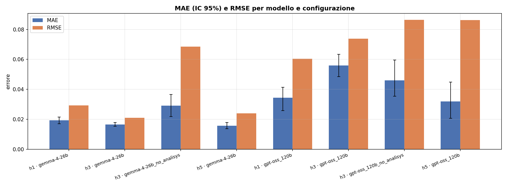
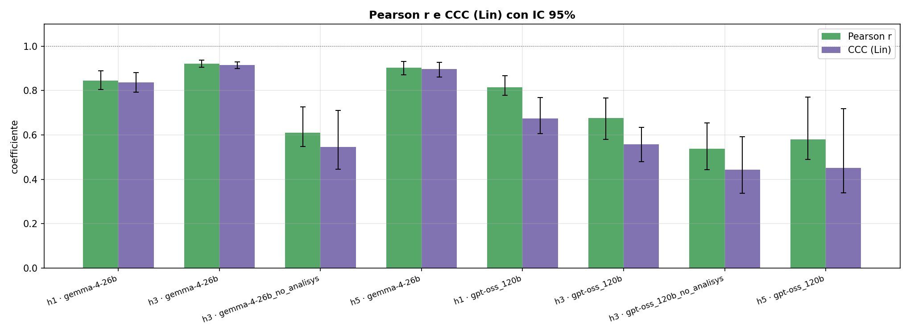

**Scatter per modello — la diagonale `y=x` è il perfetto, gemma h3/h5 è quasi sopra, gpt-oss è disperso:**

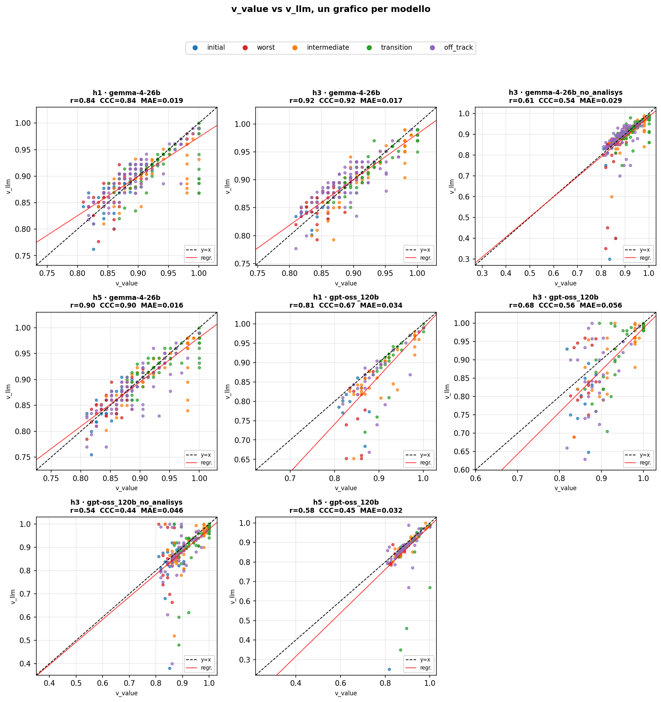

**Failure e distribuzione errori:**

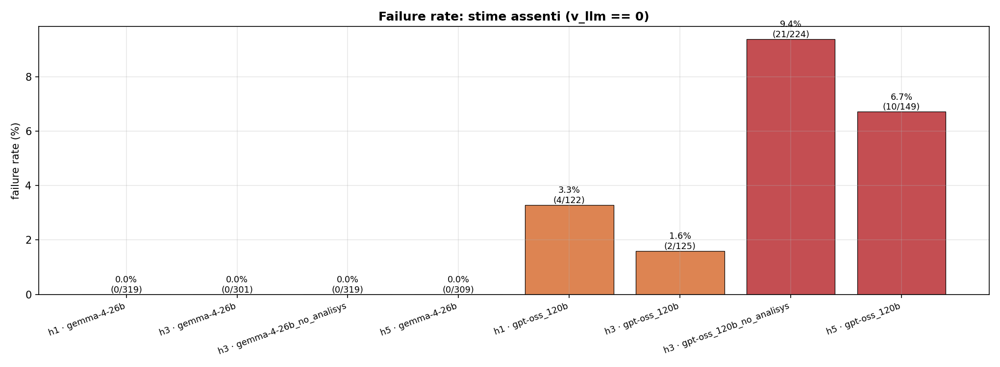
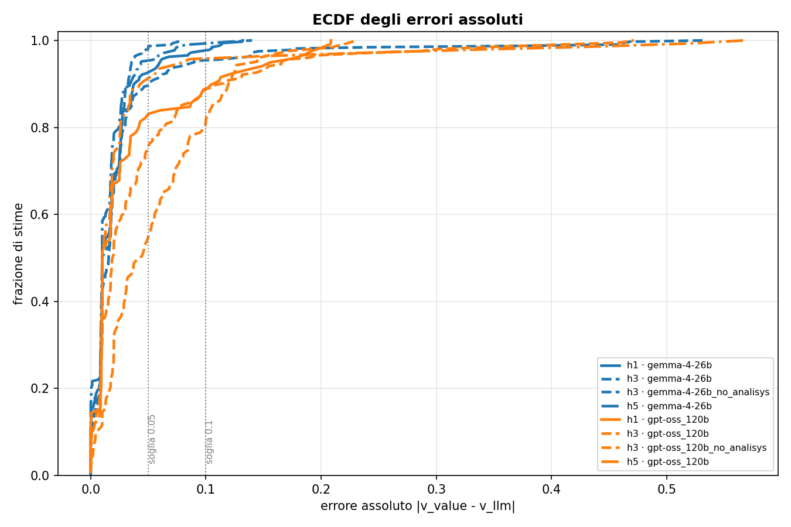

**Heatmap MAE per tipo di traiettoria — `worst`/`initial` sono i più difficili per tutti:**

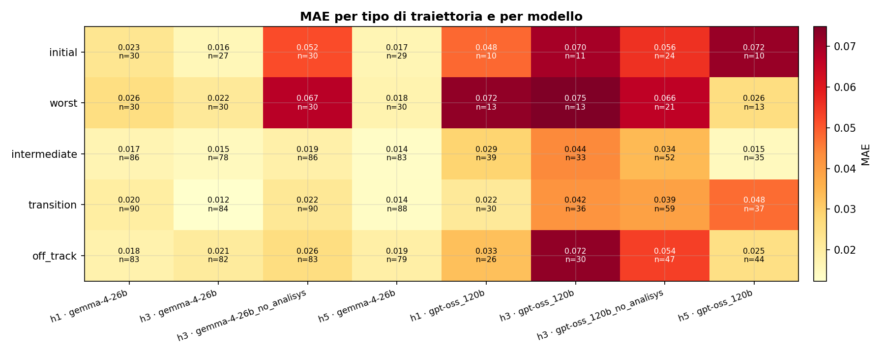

Tutti i grafici sono generati da `result/evaluate.py` e salvati in `result/grafici_V/grafici/` (11 globali + 8 per file).

---

## 7. Risultati — stima di Q* (h3)

> Le due righe `v1` e `v2` corrispondono alle due formulazioni descritte in §5.

### 7.1 Valore

| Modello / config | q_rows | failure | MAE [IC95%] | RMSE | Pearson r | CCC | bias | slope |
|---|---|---|---|---|---|---|---|---:|
| **h3 · v2_gemma-4-26b** | 314 | **0.3%** | **0.1126 [0.0951,0.1349]** | 0.2078 | 0.452 | 0.180 | −0.0968 | 1.74 |
| h3 · v2_gpt-oss_120b | 145 | 3.3% | 0.1548 [0.1108,0.2077] | 0.2865 | 0.332 | 0.093 | −0.1464 | 1.76 |
| h3 · v1_gpt-oss_120b | 478 | 35.8% | 0.3203 [0.2817,0.3598] | 0.4471 | 0.156 | 0.025 | −0.2840 | 1.14 |
| h3 · v1_gemma-4-26b | 866 | 37.5% | 0.4867 [0.4685,0.5059] | 0.5914 | 0.162 | 0.015 | −0.4753 | 1.23 |

### 7.2 Selezione azione (l'LLM sceglie l'azione con Q più alta)

| Modello / config | stati validi | Top-1 | Top-2 | Top-3 | value loss | CCC valore |
|---|---|---|---|---|---|---|
| **h3 · v2_gpt-oss_120b** | 111 | **90.1%** | 99.1% | 100% | 0.0008 | 0.093 |
| **h3 · v2_gemma-4-26b** | 207 | 81.6% | 95.7% | 100% | 0.0016 | 0.180 |
| h3 · v1_gemma-4-26b | 276 | 66.7% | 80.1% | 89.5% | 0.0039 | 0.015 |
| h3 · v1_gpt-oss_120b | 141 | 61.7% | 83.0% | 92.9% | 0.0047 | 0.025 |

Baseline casuale = 20% (5 azioni).

### Grafici principali (Q)

**Errori di valore e failure — v2 abbatte entrambi:**

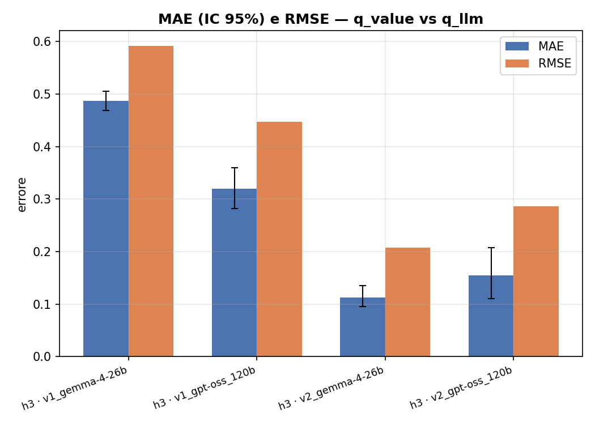
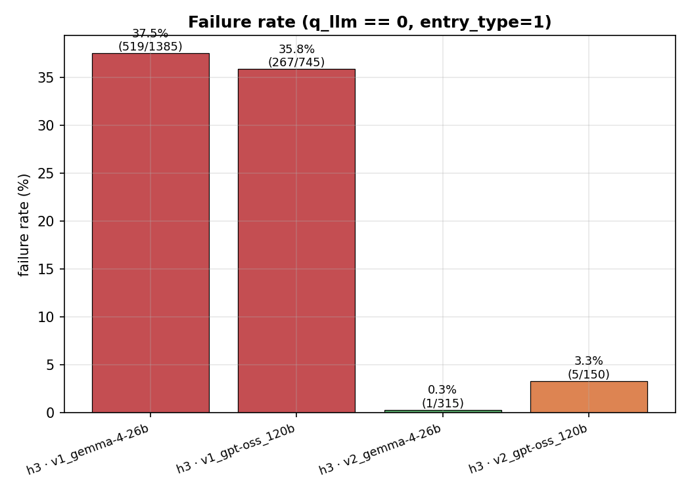

**Accuracy di selezione azione — v2 porta Top-1 a 81–90% e Top-2 ≈100%:**

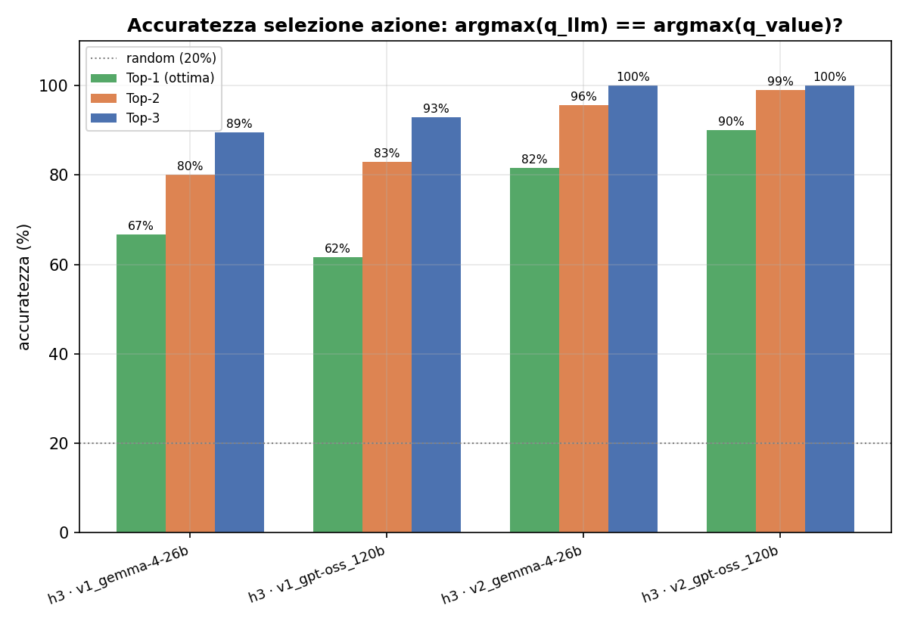
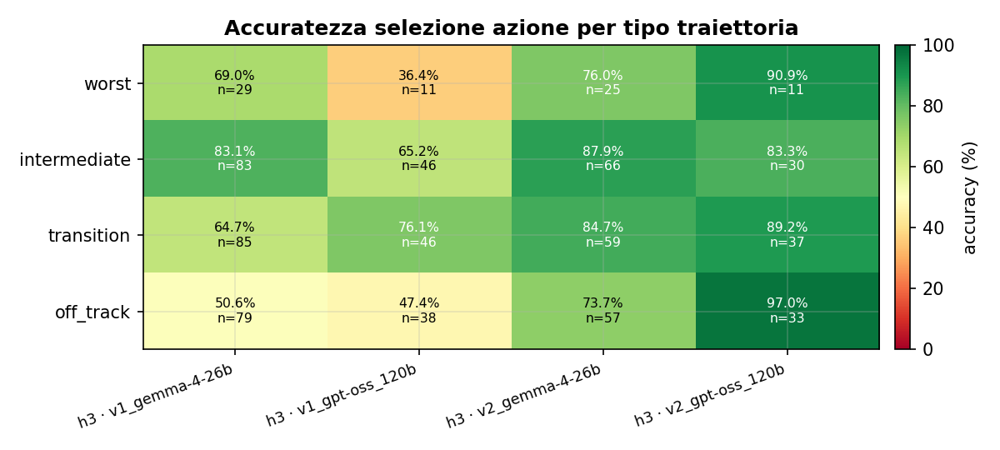

**Confusion e dettaglio per azione (esempio v2 gemma — diagonale = corretto):**

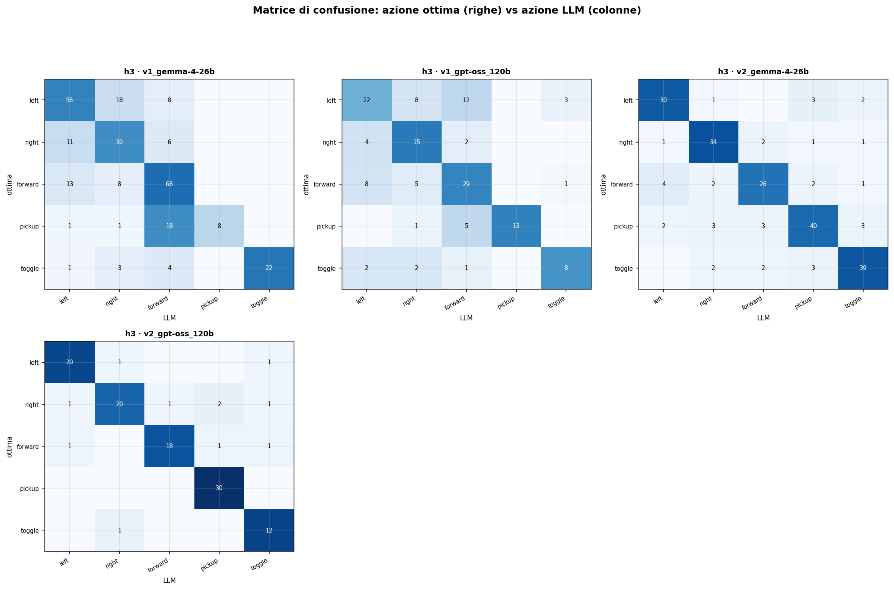
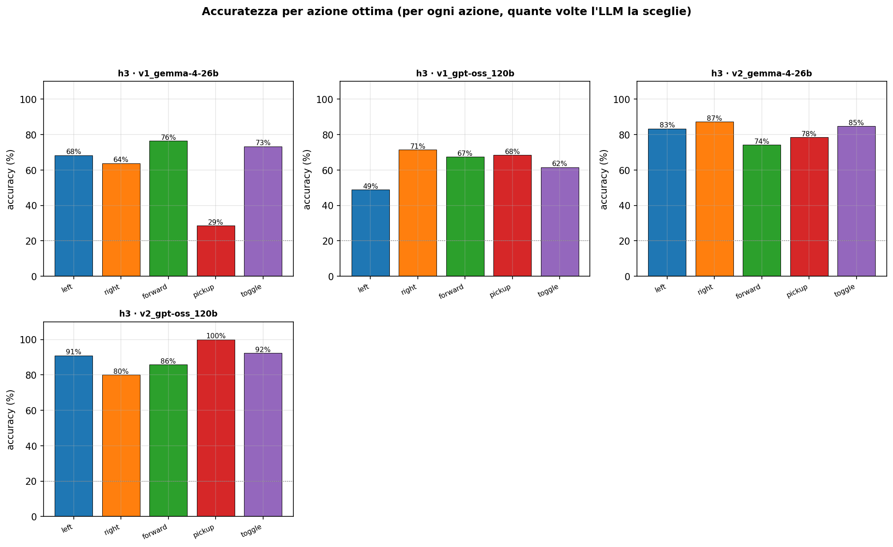

Tutti i grafici sono generati da `result/evaluate_q.py` in `result/grafici_Q/grafici/` (15 globali + 15 per file).

---

## 8. Lettura complessiva

* **V* è stimato con alta fedeltà da gemma-4-26b** anche con poco contesto (h1) e senza failure; gpt-oss-120b è utilizzabile solo a h1 e con cautela. Il campo `analisys` è necessario per entrambi.
* **Q* va chiesto come V(s'), non come Q(s,a).** Così entrambi i modelli diventano affidabili per la scelta dell'azione (Top-2 ≈ 100%).
* **Implicazione per RL:** le stime V di gemma sono già pronte per shaping potenziale, quelle Q vanno usate solo in versione v2. I 4 confronti RL (`qtable_compare.png`, `qtable_anchor_compare.png`, `qtable_warmstart_compare.png`, `ddqn_compare.png`) mostrano l'effetto di shaping/anchor/warm-start su 3000 episodi.

---

## 9. Struttura della cartella

```
thesis/
├── scripts/state_export2.py   # dataset V* (Value Iteration)
├── scripts/q_export.py        # dataset Q* / V(s')
├── llm/gconnection.py         # query LLM (V)
├── llm/gconnection-q.py       # query LLM (Q v1)
├── llm/gconnection-q2.py      # query LLM (V(s') v2)
├── docs/Prompt.txt            # prompt V (IT)
├── docs/Prompt_q.txt          # prompt Q (IT)
├── docs/en/                   # varianti EN + definizioni V/Q
├── files/metadata.csv         # ground truth V*/Q* (30 seed)
├── files/<seed>/*.txt         # storie ASCII per seed
├── result/8x8 final/V/h{1,3,5}/  # CSV LLM già pronti
├── result/8x8 final/Q/h3/        # CSV Q v1/v2
├── result/evaluate.py         # valutazione V
├── result/evaluate_q.py       # valutazione Q
├── result/grafici_V/grafici/  # grafici V (11 globali)
├── result/grafici_Q/grafici/  # grafici Q (15 globali)
├── agent/doorkey_state.py     # encode, build_known, build_potential, plot_compare
├── agent/doorkey_qtable*.py   # RL tabulare (shaping / anchor / warmstart)
├── agent/doorkey_ddqn*.py     # DDQN + shaping/anchor
└── env/                       # wrapper MiniGrid DoorKey
```

Tutti i numeri in §6–7 sono estratti verbatim dai `log_valutazione.txt` in `result/grafici_V/` e `result/grafici_Q/` (bootstrap 500 sui seed, CCC di Lin, IC 95%).
